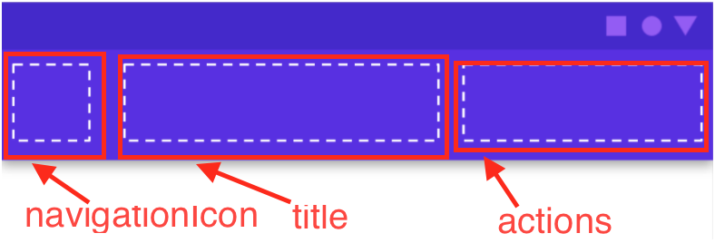

# ToolBar

## TopBar

TopAppBar

### param

| 函數 | 說明 | Type|
| --- | --- | --- |
| navigationIcon | Block of Toolbar Icon | lambda，default:null |
| title | Block of Toolbar Title | lambda |
| actions | Block of Toolbar Action | lambda，default: {} |
| backgroundColor | TopAppBar背景顏色 | Color |
| contentColor | TopAppBar 內容物(EX: Text, Icon)顏色 | Color |
| elevation | 陰影高度 | DP |
| modifier | 元素修饰符 | Modifier |



### use

```
TopAppBar(
    navigationIcon = {
        IconButton(onClick = { /*TODO*/ }) {
            Icon(
                imageVector = Icons.Default.Home,
                contentDescription = null
            )
        }
    },
    title = {
        Text(
            text = stringResource(R.string.app_name),
        )
    },
    actions = { ActionMenu() },
    backgroundColor = Color.Green,
    contentColor = Color.White,
    elevation = 0.dp
)
```

## BottomBar

BottomAppBar

### param

| 參數 | 說明 | 型態 |
| --- | --- | --- |
| backgroundColor | 背景顏色 | Color |
| contentColor | 內容物顏色 | Color |
| cutoutShape | 切口形狀 | Shape |
| elevation | 陰影 | Dp |
| contentPadding | 內容物距的Padding | PaddingValues |
| content |  |  |

### Use

```
BottomAppBar(
    backgroundColor = Color(0xFF1976D2),
    cutoutShape = CircleShape,
) {
    Row(modifier = Modifier.weight(1f)) {
        Box(modifier = Modifier.width(8.dp))
        buildBottomMenuItem(icon = Icons.Default.Home, text = "Home", click = {})
        buildBottomMenuItem(icon = Icons.Default.Favorite, text = "Favorite", click = {})

        Box(modifier = Modifier.weight(1f)) {
            Row(
                horizontalArrangement = Arrangement.End,
                modifier = Modifier.fillMaxWidth()
            ) {
                Box(modifier = Modifier.width(8.dp))
                buildBottomMenuItem(
                    icon = Icons.Filled.Favorite,
                    text = "Item 3",
                    click = {})
                buildBottomMenuItem(
                    icon = Icons.Filled.Favorite,
                    text = "Item 4",
                    click = {})
            }
        }
    }
}

@Composable
fun buildBottomMenuItem(icon: ImageVector, text: String, click: () -> Unit) {
    Column(
        horizontalAlignment = Alignment.CenterHorizontally,
        modifier = Modifier.absolutePadding(left = 8.dp, right = 8.dp)
    ) {
        IconButton(click, modifier = Modifier.size(24.dp)) {
            Icon(
                imageVector = icon, contentDescription = null,
                tint = Color.White
            )
        }
        Text(text = text, color = Color.White)
    }
}
```
