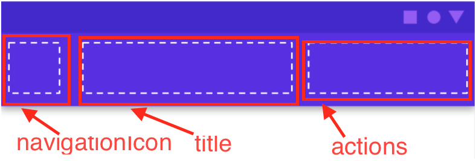

# TopAppBar

toolbar

## TopAppBar

### param

| 函數 | 說明 | Type|
| --- | --- | --- |
| navigationIcon | Block of Toolbar Icon | lambda，default:null |
| title | Block of Toolbar Title | lambda |
| actions | Block of Toolbar Action | lambda，default: {} |
| backgroundColor | TopAppBar背景顏色 | Color |
| contentColor | TopAppBar 內容物(EX: Text, Icon)顏色 | Color |
| elevation | 陰影高度 | DP |
| modifier | 元素修饰符 | Modifier |



## use

```
TopAppBar(
    navigationIcon = {
        IconButton(onClick = { /*TODO*/ }) {
            Icon(
                imageVector = Icons.Default.Home,
                contentDescription = null
            )
        }
    },
    title = {
        Text(
            text = stringResource(R.string.app_name),
        )
    },
    actions = { ActionMenu() },
    backgroundColor = Color.Green,
    contentColor = Color.White,
    elevation = 0.dp
)
```